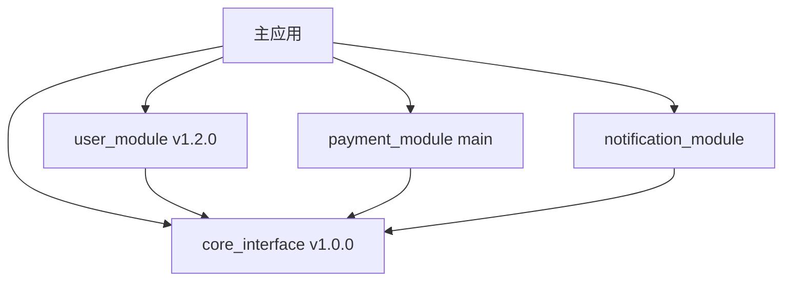

以下是专为 **Flutter 开发** 场景设计的模块解耦最佳实践文档，聚焦于将功能拆分为独立的 `package`（甚至独立仓库），并通过 **接口（抽象）管理依赖**，实现高内聚、低耦合的可维护架构。

---

# **Flutter 模块解耦最佳实践方案**

> **适用场景**：大型 Flutter 应用、团队协作开发、模块独立维护/发布、未来可能向微前端或插件化演进。

---

## 1. 目标

- 将功能拆分为独立的 `package`（本地或远程）。
- 模块之间通过 **接口（abstract class / interface）** 通信，避免直接依赖具体实现。
- 支持模块独立开发、测试、版本管理和部署。
- 提高可测试性、可替换性和可扩展性。

---

## 2. 核心原则

### ✅ 依赖倒置原则 (DIP)
> 高层模块不依赖低层模块，二者都依赖抽象。

- 业务模块（如 `order`）不直接依赖数据模块（如 `user_repository`），而是依赖一个 `UserService` 接口。
- 实现由外部注入。

### ✅ 面向接口编程
- 所有跨模块调用通过 `abstract class` 或 `interface` 定义契约。
- 接口定义在独立的 `contracts` 或由调用方定义（推荐后者）。

### ✅ 关注点分离
- 每个模块职责单一，如：
  - `auth_package`：处理登录、Token 管理
  - `user_package`：用户信息获取与缓存
  - `analytics_package`：埋点服务
  - `payment_package`：支付流程

---

## 3. 项目结构建议

### 3.1 推荐结构：接口包设计

```
myapp/
├── lib/
│   └── main.dart
├── packages/
│   ├── core_interface/         # 🎯 核心接口包（独立仓库）
│   │   ├── lib/
│   │   │   ├── src/
│   │   │   │   ├── interfaces/
│   │   │   │   │   ├── i_user_service.dart
│   │   │   │   │   ├── i_payment_service.dart
│   │   │   │   │   └── i_notification_service.dart
│   │   │   │   ├── models/
│   │   │   │   │   ├── user.dart
│   │   │   │   │   └── payment.dart
│   │   │   │   └── events/
│   │   │   │       ├── user_events.dart
│   │   │   │       └── payment_events.dart
│   │   │   └── core_interface.dart
│   │   ├── pubspec.yaml
│   │   └── README.md
│   ├── user_module/            # 用户模块（独立仓库）
│   ├── payment_module/         # 支付模块（独立仓库）
│   ├── notification_module/    # 通知模块（独立仓库）
│   └── analytics_module/       # 埋点模块（独立仓库）
├── pubspec.yaml
└── README.md
```

### 3.2 接口包的优势

- **🎯 统一管理**：所有接口集中在一个包中，便于维护
- **🔄 版本控制**：接口变更时只需更新一个包
- **📦 依赖清晰**：其他模块只需依赖 `core_interface`
- **🧪 测试友好**：Mock 接口时只需关注一个包
- **🚀 发布简单**：接口稳定后，其他模块可以锁定版本

### 3.3 接口包设计原则

```dart
// core_interface/lib/src/interfaces/i_user_service.dart
/// 用户服务接口
/// 
/// 定义用户相关的所有操作契约
/// 版本：1.0.0
/// 兼容性：向后兼容
abstract class IUserService {
  /// 获取当前用户
  /// 
  /// 如果用户未登录，返回 null
  Future<User?> getCurrentUser();
  
  /// 用户登录
  /// 
  /// 参数：
  /// - [email] 用户邮箱
  /// - [password] 用户密码
  /// 
  /// 异常：
  /// - [AuthenticationException] 认证失败
  /// - [NetworkException] 网络错误
  Future<void> login(String email, String password);
  
  /// 用户登出
  Future<void> logout();
  
  /// 用户状态流
  /// 
  /// 监听用户登录状态变化
  Stream<User?> get userStream;
}

// core_interface/lib/src/interfaces/i_payment_service.dart
abstract class IPaymentService {
  Future<PaymentResult> processPayment(PaymentRequest request);
  Future<List<PaymentHistory>> getPaymentHistory();
  Future<PaymentStatus> getPaymentStatus(String paymentId);
}

// core_interface/lib/src/events/user_events.dart
abstract class UserEvent {
  final DateTime timestamp;
  final String eventId;
  
  UserEvent()
      : timestamp = DateTime.now(),
        eventId = const Uuid().v4();
}

class UserLoggedInEvent extends UserEvent {
  final User user;
  UserLoggedInEvent(this.user);
}

class UserLoggedOutEvent extends UserEvent {
  final User user;
  UserLoggedOutEvent(this.user);
}
```

---

## 4. 解耦策略与实践

### 4.1 接口定义位置：**由使用者定义（Recommended）**

> 避免循环依赖，符合“稳定依赖原则”。

- **谁使用，谁定义接口**。
- 实现方实现该接口。

#### 示例：订单模块需要用户服务

##### 在 `order_package` 中定义接口

```dart
// packages/order_package/lib/src/contracts/user_service.dart
abstract class UserService {
  Future<String> getUserName(String userId);
  Future<bool> isLoggedIn();
}
```

##### 在 `user_package` 中实现接口

```dart
// packages/user_package/lib/user_service_impl.dart
import 'package:order_package/contracts/user_service.dart'; // 依赖 order_package 的接口

class UserServiceImpl extends UserService {
  @override
  Future<String> getUserName(String userId) async {
    // 调用 API 或本地数据库
    return 'Alice';
  }

  @override
  Future<bool> isLoggedIn() async {
    // 检查 Token
    return true;
  }
}
```

> ⚠️ 注意：此时 `user_package` 依赖 `order_package`，看似“反向”，但这是 **依赖于抽象** 的正确体现。

---

### 4.2 依赖注入（DI）管理

推荐使用 `get_it` + `injectable` 实现依赖注入。

#### 安装依赖

```yaml
# pubspec.yaml
dependencies:
  get_it: ^7.6.0
  core_interface: ^1.0.0  # 添加接口包依赖
dev_dependencies:
  injectable_generator: ^2.1.0
  build_runner: ^2.4.0
```

#### 4.2.1 包级别的服务注册器

每个模块都有自己的服务注册器，负责注册该模块内的所有服务：

```dart
// user_module/lib/src/user_module_registrar.dart
import 'package:get_it/get_it.dart';
import 'package:core_interface/core_interface.dart';
import 'user_service_impl.dart';
import 'user_repository_impl.dart';

class UserModuleRegistrar {
  /// 注册用户模块的所有服务
  static void register() {
    final getIt = GetIt.instance;
    
    // 注册用户服务实现
    getIt.registerSingleton<IUserService>(UserServiceImpl());
    
    // 注册用户仓库实现
    getIt.registerSingleton<IUserRepository>(UserRepositoryImpl());
    
    // 注册其他用户相关服务...
  }
  
  /// 注册单个服务（可选）
  static void registerService<T extends Object>(T instance) {
    GetIt.instance.registerSingleton<T>(instance);
  }
}

// payment_module/lib/src/payment_module_registrar.dart
import 'package:get_it/get_it.dart';
import 'package:core_interface/core_interface.dart';
import 'payment_service_impl.dart';

class PaymentModuleRegistrar {
  static void register() {
    final getIt = GetIt.instance;
    
    // 注册支付服务实现
    getIt.registerSingleton<IPaymentService>(PaymentServiceImpl());
    
    // 注册支付相关服务...
  }
}

// notification_module/lib/src/notification_module_registrar.dart
import 'package:get_it/get_it.dart';
import 'package:core_interface/core_interface.dart';
import 'notification_service_impl.dart';

class NotificationModuleRegistrar {
  static void register() {
    final getIt = GetIt.instance;
    
    // 注册通知服务实现
    getIt.registerSingleton<INotificationService>(NotificationServiceImpl());
  }
}
```

#### 4.2.2 主应用的服务注册器

主应用负责协调所有模块的服务注册：

```dart
// lib/src/di/app_service_registrar.dart
import 'package:get_it/get_it.dart';
import 'package:core_interface/core_interface.dart';

/// 应用级别的服务注册器
/// 负责注册所有模块的服务
class AppServiceRegistrar {
  static final GetIt _getIt = GetIt.instance;
  
  /// 注册所有模块的服务
  static void registerAll() {
    print('🚀 开始注册所有模块服务...');
    
    // 按依赖顺序注册模块
    _registerCoreServices();
    _registerUserModule();
    _registerPaymentModule();
    _registerNotificationModule();
    
    print('✅ 所有模块服务注册完成');
  }
  
  /// 注册核心服务
  static void _registerCoreServices() {
    print('📦 注册核心服务...');
    
    // 注册核心服务，如网络、存储等
    _getIt.registerSingleton<INetworkService>(NetworkServiceImpl());
    _getIt.registerSingleton<IStorageService>(StorageServiceImpl());
  }
  
  /// 注册用户模块
  static void _registerUserModule() {
    print('👤 注册用户模块...');
    
    // 导入并注册用户模块
    // 注意：这里需要确保 user_module 已经被导入
    try {
      // 动态导入用户模块注册器
      _importAndRegisterUserModule();
    } catch (e) {
      print('⚠️ 用户模块注册失败: $e');
    }
  }
  
  /// 注册支付模块
  static void _registerPaymentModule() {
    print('💳 注册支付模块...');
    
    try {
      _importAndRegisterPaymentModule();
    } catch (e) {
      print('⚠️ 支付模块注册失败: $e');
    }
  }
  
  /// 注册通知模块
  static void _registerNotificationModule() {
    print('🔔 注册通知模块...');
    
    try {
      _importAndRegisterNotificationModule();
    } catch (e) {
      print('🔔 通知模块注册失败: $e');
    }
  }
  
  /// 按需注册特定模块
  static void registerModule(String moduleName) {
    switch (moduleName) {
      case 'user':
        _registerUserModule();
        break;
      case 'payment':
        _registerPaymentModule();
        break;
      case 'notification':
        _registerNotificationModule();
        break;
      default:
        print('❌ 未知模块: $moduleName');
    }
  }
  
  /// 动态导入并注册用户模块
  static void _importAndRegisterUserModule() {
    // 这里需要确保 user_module 已经被导入
    // 可以通过条件导入或者延迟加载实现
    if (_isModuleAvailable('user_module')) {
      // 调用用户模块的注册器
      // UserModuleRegistrar.register();
    }
  }
  
  /// 检查模块是否可用
  static bool _isModuleAvailable(String moduleName) {
    try {
      // 尝试导入模块，如果成功说明模块可用
      // 这里可以通过反射或者其他方式检查
      return true;
    } catch (e) {
      return false;
    }
  }
}

/// 简化的服务注册器（推荐使用）
class SimpleServiceRegistrar {
  static void registerAll() {
    // 直接调用各模块的注册器
    // 这种方式更简单直接，但需要确保所有模块都被导入
    
    // 注意：这些调用需要在对应的模块被导入后才能执行
    // UserModuleRegistrar.register();
    // PaymentModuleRegistrar.register();
    // NotificationModuleRegistrar.register();
  }
}
```

#### 4.2.3 标记注入

```dart
// user_module/lib/src/user_service_impl.dart
import 'package:core_interface/core_interface.dart';
import 'package:injectable/injectable.dart';

@injectable
class UserServiceImpl implements IUserService {
  final IUserRepository _userRepository;
  
  UserServiceImpl(this._userRepository);
  
  @override
  Future<User?> getCurrentUser() async {
    return await _userRepository.getCurrentUser();
  }
  
  @override
  Future<void> login(String email, String password) async {
    // 实现登录逻辑
  }
  
  @override
  Future<void> logout() async {
    // 实现登出逻辑
  }
  
  @override
  Stream<User?> get userStream => _userRepository.userStream;
}

// user_module/lib/src/user_repository_impl.dart
import 'package:core_interface/core_interface.dart';
import 'package:injectable/injectable.dart';

@injectable
class UserRepositoryImpl implements IUserRepository {
  @override
  Future<User?> getCurrentUser() async {
    // 实现获取当前用户逻辑
    return null;
  }
  
  @override
  Stream<User?> get userStream => Stream.empty();
}
```

#### 4.2.4 在主应用中注册

```dart
// lib/main.dart
import 'package:flutter/material.dart';
import 'package:get_it/get_it.dart';
import 'package:core_interface/core_interface.dart';
import 'src/di/app_service_registrar.dart';

void main() async {
  WidgetsFlutterBinding.ensureInitialized();
  
  // 🎯 注册所有模块的服务
  AppServiceRegistrar.registerAll();
  
  runApp(MyApp());
}

class MyApp extends StatelessWidget {
  @override
  Widget build(BuildContext context) {
    // 从服务定位器获取服务实例
    final userService = GetIt.I<IUserService>();
    final paymentService = GetIt.I<IPaymentService>();
    
    return MaterialApp(
      title: '模块化 Flutter 应用',
      home: HomeScreen(
        userService: userService,
        paymentService: paymentService,
      ),
    );
  }
}

// lib/src/screens/home_screen.dart
class HomeScreen extends StatelessWidget {
  final IUserService userService;
  final IPaymentService paymentService;
  
  HomeScreen({
    required this.userService,
    required this.paymentService,
  });
  
  @override
  Widget build(BuildContext context) {
    return Scaffold(
      appBar: AppBar(title: Text('首页')),
      body: Column(
        children: [
          // 用户信息
          UserInfoWidget(userService: userService),
          
          // 支付功能
          PaymentWidget(paymentService: paymentService),
        ],
      ),
    );
  }
}
```

#### 4.2.5 延迟加载和条件注册

对于大型应用，可以使用延迟加载来优化启动时间：

```dart
// lib/src/di/lazy_module_loader.dart
import 'package:get_it/get_it.dart';

/// 延迟加载模块的服务注册器
class LazyModuleLoader {
  static final Map<String, bool> _loadedModules = {};
  
  /// 延迟加载模块
  static Future<void> loadModule(String moduleName) async {
    if (_loadedModules[moduleName] == true) {
      print('✅ 模块 $moduleName 已经加载');
      return;
    }
    
    print('🔄 开始加载模块: $moduleName');
    
    try {
      switch (moduleName) {
        case 'user':
          await _loadUserModule();
          break;
        case 'payment':
          await _loadPaymentModule();
          break;
        case 'notification':
          await _loadNotificationModule();
          break;
        default:
          print('❌ 未知模块: $moduleName');
          return;
      }
      
      _loadedModules[moduleName] = true;
      print('✅ 模块 $moduleName 加载完成');
    } catch (e) {
      print('❌ 模块 $moduleName 加载失败: $e');
    }
  }
  
  /// 加载用户模块
  static Future<void> _loadUserModule() async {
    // 动态导入用户模块
    // 这里可以通过条件导入或者延迟加载实现
    await Future.delayed(Duration(milliseconds: 100));
    
    // 注册用户模块服务
    // UserModuleRegistrar.register();
  }
  
  /// 加载支付模块
  static Future<void> _loadPaymentModule() async {
    await Future.delayed(Duration(milliseconds: 100));
    // PaymentModuleRegistrar.register();
  }
  
  /// 加载通知模块
  static Future<void> _loadNotificationModule() async {
    await Future.delayed(Duration(milliseconds: 100));
    // NotificationModuleRegistrar.register();
  }
  
  /// 检查模块是否已加载
  static bool isModuleLoaded(String moduleName) {
    return _loadedModules[moduleName] == true;
  }
  
  /// 获取已加载的模块列表
  static List<String> getLoadedModules() {
    return _loadedModules.entries
        .where((entry) => entry.value)
        .map((entry) => entry.key)
        .toList();
  }
}
```

#### 4.2.6 依赖注入流程图

```mermaid
graph TD
    A[应用启动] --> B[main() 函数]
    B --> C[AppServiceRegistrar.registerAll()]
    
    C --> D[注册核心服务]
    C --> E[注册用户模块]
    C --> F[注册支付模块]
    C --> G[注册通知模块]
    
    D --> H[INetworkService]
    D --> I[IStorageService]
    
    E --> J[UserModuleRegistrar.register()]
    J --> K[IUserService]
    J --> L[IUserRepository]
    
    F --> M[PaymentModuleRegistrar.register()]
    M --> N[IPaymentService]
    
    G --> O[NotificationModuleRegistrar.register()]
    O --> P[INotificationService]
    
    H --> Q[GetIt 服务定位器]
    I --> Q
    K --> Q
    L --> Q
    N --> Q
    P --> Q
    
    Q --> R[Widget 使用服务]
    R --> S[GetIt.I&lt;IService&gt;()]
```

#### 4.2.7 服务注入器调用时机总结

**🎯 服务注入器的调用时机：**

1. **应用启动时（main 函数中）**
   ```dart
   void main() async {
     // 1. 确保 Flutter 绑定初始化
     WidgetsFlutterBinding.ensureInitialized();
     
     // 2. 注册所有模块的服务
     AppServiceRegistrar.registerAll();
     
     // 3. 启动应用
     runApp(MyApp());
   }
   ```

2. **模块导入时**
   ```dart
   // 在模块的 main 文件或初始化文件中
   class UserModule {
     static void initialize() {
       UserModuleRegistrar.register();
     }
   }
   ```

3. **按需加载时**
   ```dart
   // 延迟加载模块
   await LazyModuleLoader.loadModule('payment');
   ```

4. **测试时**
   ```dart
   // 在测试中注册 Mock 服务
   setUp(() {
     GetIt.instance.registerSingleton<IUserService>(MockUserService());
   });
   ```

**🔑 关键要点：**

- **服务注册必须在服务使用之前完成**
- **主应用负责协调所有模块的服务注册**
- **每个模块有自己的服务注册器**
- **可以通过延迟加载优化启动时间**
- **测试时可以注册 Mock 实现**

---

### 4.3 独立仓库管理

每个 `package` 可独立为 Git 仓库：

- `git@github.com:org/core_interface.git`  # 🎯 核心接口包
- `git@github.com:org/user_module.git`     # 用户模块
- `git@github.com:org/payment_module.git`  # 支付模块
- `git@github.com:org/notification_module.git` # 通知模块

在主项目中通过 Git 依赖引入：

```yaml
# myapp/pubspec.yaml
dependencies:
  # 🎯 核心接口包 - 所有模块的基础
  core_interface:
    git:
      url: git@github.com:org/core_interface.git
      ref: v1.0.0  # 接口包版本要稳定
  
  # 业务模块
  user_module:
    git:
      url: git@github.com:org/user_module.git
      ref: v1.2.0
  payment_module:
    git:
      url: git@github.com:org/payment_module.git
      ref: v0.5.0
  notification_module:
    git:
      url: git@github.com:org/notification_module.git
      ref: main
```

> ✅ 支持语义化版本控制、独立 CI/CD、权限管理。
> 🎯 **接口包版本管理**：接口包版本变更需要谨慎，建议使用语义化版本控制

---

## 5. 完整示例：订单模块依赖用户服务

### 步骤 1：定义接口（在 `core_interface`）

```dart
// core_interface/lib/src/interfaces/i_user_service.dart
abstract class IUserService {
  Future<String> getUserName(String userId);
  Future<User?> getCurrentUser();
  Stream<User?> get userStream;
}

// core_interface/lib/src/models/user.dart
class User {
  final String id;
  final String name;
  final String email;
  
  const User({
    required this.id,
    required this.name,
    required this.email,
  });
}
```

### 步骤 2：实现接口（在 `user_module`）

```dart
// user_module/lib/src/user_service_impl.dart
import 'package:core_interface/core_interface.dart';

@injectable
class UserServiceImpl implements IUserService {
  @override
  Future<String> getUserName(String userId) async {
    await Future.delayed(Duration(milliseconds: 300)); // 模拟网络
    return "User-$userId";
  }
  
  @override
  Future<User?> getCurrentUser() async {
    // 实现获取当前用户逻辑
    return null;
  }
  
  @override
  Stream<User?> get userStream => Stream.empty();
}
```

### 步骤 3：订单模块使用接口

```dart
// order_module/lib/src/order_screen.dart
import 'package:core_interface/core_interface.dart';

class OrderScreen extends StatelessWidget {
  final IUserService userService;

  OrderScreen({required this.userService});

  @override
  Widget build(BuildContext context) {
    return ElevatedButton(
      onPressed: () async {
        final name = await userService.getUserName('123');
        print('User: $name');
      },
      child: Text('Create Order'),
    );
  }
}
```

### 步骤 4：主应用注入实现

```dart
// lib/main.dart
import 'package:core_interface/core_interface.dart';
import 'package:user_module/user_module.dart';

void main() {
  // 注册实现
  GetIt.I.registerSingleton<IUserService>(UserServiceImpl());
  
  runApp(MyApp());
}
```

---

## 6. 高级模式：事件总线或服务定位器（可选）

对于跨多个模块的通信（如登录状态变更通知），可结合 `event_bus` 或自定义 `Service Locator`。

```dart
// core_interface/lib/src/events/user_events.dart
class UserLoggedInEvent {
  final String userId;
  final DateTime timestamp;
  
  UserLoggedInEvent(this.userId) : timestamp = DateTime.now();
}

class UserLoggedOutEvent {
  final String userId;
  final DateTime timestamp;
  
  UserLoggedOutEvent(this.userId) : timestamp = DateTime.now();
}

// 在 user_module 中发布
EventBus().publish(UserLoggedInEvent('123'));

// 在 order_module 或 payment_module 中监听
EventBus().on<UserLoggedInEvent>().listen((event) {
  print('User logged in: ${event.userId} at ${event.timestamp}');
});
```

---

## 7. 工具与支持

| 功能 | 推荐工具 |
|------|----------|
| 依赖注入 | `get_it` + `injectable` |
| 状态管理 | `provider`, `riverpod`, `bloc`（模块内） |
| 包管理 | `pub.dev`、私有 Pub 服务器、Git 依赖 |
| 代码生成 | `build_runner`, `injectable_generator` |
| 接口 Mock | `mocktail`（推荐）、`mockito` |
| CI/CD | GitHub Actions、Codemagic |

---

## 8. 注意事项

- ❌ 避免在接口中传递具体类（如 `UserModelImpl`），应使用 DTO。
- ✅ 接口应稳定，变更需考虑向后兼容。
- ✅ 每个 package 应有独立的 `README.md` 和 `CHANGELOG.md`。
- ✅ 使用 `dart pub publish --dry-run` 验证包结构。
- ✅ 模块间通信避免直接调用静态方法或单例。

---

## 9. 总结

通过 **接口抽象 + 依赖注入 + 独立 package**，Flutter 应用可以实现高度解耦的模块化架构：

- ✅ 模块可独立开发、测试、发布
- ✅ 依赖清晰，易于替换实现（如测试时使用 Mock）
- ✅ 为未来插件化、动态加载、微前端打下基础

建议从核心业务模块（如 `auth`、`user`）开始试点，逐步推广。

---

## 10. Package 发布和版本管理

### 10.1 版本号规范

遵循语义化版本控制（Semantic Versioning）：

- **主版本号（Major）**：不兼容的 API 修改
- **次版本号（Minor）**：向下兼容的功能性新增
- **修订号（Patch）**：向下兼容的问题修正

```yaml
# core_interface/pubspec.yaml
name: core_interface
version: 1.0.0  # 接口包版本要稳定

# user_module/pubspec.yaml
name: user_module
version: 1.2.0  # 业务模块可以更频繁地更新
```

### 10.2 发布流程

#### 接口包发布流程
```bash
# 1. 代码审查通过
git checkout -b release/v1.0.0

# 2. 测试用例全部通过
flutter test

# 3. 更新 CHANGELOG.md
echo "## [1.0.0] - $(date +%Y-%m-%d)" >> CHANGELOG.md
echo "- 初始版本发布" >> CHANGELOG.md

# 4. 打标签发布
git add .
git commit -m "Release v1.0.0"
git tag v1.0.0
git push origin v1.0.0

# 5. 发布到私有 Pub 服务器
dart pub publish --server=https://your-private-pub.com
```

#### 业务模块发布流程
```bash
# 1. 确保接口兼容性
flutter analyze
flutter test

# 2. 更新依赖版本
# 检查 core_interface 版本兼容性

# 3. 发布模块
git tag v1.2.0
git push origin v1.2.0
dart pub publish
```

### 10.3 版本兼容性管理

#### 接口演进策略
```dart
// core_interface/lib/src/interfaces/i_user_service.dart

// 版本 1.0.0
abstract class IUserService {
  Future<User?> getCurrentUser();
  Future<void> login(String email, String password);
}

// 版本 1.1.0 - 向后兼容
abstract class IUserService {
  Future<User?> getCurrentUser();
  Future<void> login(String email, String password);
  
  // 新增方法，提供默认实现
  Future<void> loginWithBiometric() async {
    throw UnimplementedError('Biometric login not supported');
  }
}

// 版本 2.0.0 - 破坏性变更
abstract class IUserServiceV2 {
  Future<UserResult> getCurrentUser();  // 返回类型变更
  Future<LoginResult> login(LoginRequest request);  // 参数类型变更
}
```

---

## 11. 接口演进策略

### 11.1 向后兼容性保证

#### 添加新方法
```dart
// ✅ 正确：新方法提供默认实现
abstract class IUserService {
  Future<User?> getCurrentUser();
  
  // 新方法，提供默认实现
  Future<UserProfile?> getUserProfile() async => null;
}
```

#### 修改现有方法
```dart
// ❌ 错误：直接修改方法签名
abstract class IUserService {
  // 原来：Future<User?> getCurrentUser();
  Future<UserResult> getCurrentUser();  // 破坏性变更
}

// ✅ 正确：保持原有方法，添加新方法
abstract class IUserService {
  Future<User?> getCurrentUser();  // 保持兼容
  
  // 新方法，返回更丰富的结果
  Future<UserResult> getCurrentUserV2();
}
```

### 11.2 接口废弃和迁移

#### 废弃旧接口
```dart
abstract class IUserService {
  Future<User?> getCurrentUser();
  
  @Deprecated('Use getCurrentUserV2() instead')
  Future<User?> getCurrentUserLegacy();
  
  Future<UserResult> getCurrentUserV2();
}
```

#### 迁移指南
```dart
// 旧代码
final user = await userService.getCurrentUserLegacy();

// 新代码
final result = await userService.getCurrentUserV2();
final user = result.user;
```

---

## 12. 多仓库管理

### 12.1 Git 依赖管理

#### 版本锁定策略
```yaml
# 主应用 pubspec.yaml
dependencies:
  core_interface:
    git:
      url: git@github.com:org/core_interface.git
      ref: v1.0.0  # 锁定稳定版本
  
  user_module:
    git:
      url: git@github.com:org/user_module.git
      ref: v1.2.0  # 锁定具体版本
  
  payment_module:
    git:
      url: git@github.com:org/payment_module.git
      ref: main    # 开发阶段使用最新代码
```

#### 依赖关系图


## 13. 性能考虑

### 13.1 包大小优化

#### 依赖分析
```bash
# 分析包大小
flutter build apk --analyze-size

# 查看依赖树
flutter pub deps
```

#### 优化策略
```dart
// 使用 export 减少导入
// core_interface/lib/core_interface.dart
export 'src/interfaces/i_user_service.dart';
export 'src/interfaces/i_payment_service.dart';
export 'src/models/user.dart';
export 'src/events/user_events.dart';

// 在其他模块中只需要一个导入
import 'package:core_interface/core_interface.dart';
```

### 13.2 启动时间影响

#### 延迟加载
```dart
// 使用 lazy loading 减少启动时间
class LazyModuleLoader {
  static Future<void> loadModule(String moduleName) async {
    switch (moduleName) {
      case 'payment':
        await import('package:payment_module/payment_module.dart');
        break;
      case 'notification':
        await import('package:notification_module/notification_module.dart');
        break;
    }
  }
}
```

---

## 14. 团队协作

### 14.1 接口约定

#### 接口设计原则
- **单一职责**：每个接口只负责一个功能领域
- **稳定性**：接口一旦发布，变更需要谨慎
- **文档完整**：每个方法都要有完整的文档注释
- **测试覆盖**：接口要有完整的测试用例

#### 代码审查要点
- [ ] 接口设计是否符合单一职责原则
- [ ] 是否有完整的文档注释
- [ ] 是否有对应的测试用例
- [ ] 是否考虑了向后兼容性
- [ ] 依赖关系是否清晰

### 14.2 文档同步

#### 接口文档模板
```dart
/// 用户服务接口
/// 
/// 提供用户认证、用户信息管理等功能
/// 
/// 版本：1.0.0
/// 兼容性：向后兼容
/// 维护者：@team-user
/// 
/// 使用示例：
/// ```dart
/// final userService = ServiceLocator.get<IUserService>();
/// final user = await userService.getCurrentUser();
/// ```
abstract class IUserService {
  /// 获取当前用户
  /// 
  /// 如果用户未登录，返回 null
  /// 
  /// 返回值：
  /// - [User] 当前用户信息
  /// - null 用户未登录
  /// 
  /// 异常：
  /// - [AuthenticationException] 认证失败
  /// - [NetworkException] 网络错误
  Future<User?> getCurrentUser();
}
```

---

## 15. 最佳实践总结

### 15.1 设计原则

#### ✅ 推荐做法
1. **接口优先**：先定义接口，再实现具体类
2. **依赖注入**：通过构造函数注入依赖，避免直接创建
3. **事件驱动**：使用事件总线进行模块间通信
4. **单一职责**：每个模块只负责一个功能领域
5. **接口隔离**：接口要小而专注，不要过于臃肿
6. **版本管理**：使用语义化版本控制，保证向后兼容

#### ❌ 避免做法
1. **直接依赖**：模块间直接引用具体类
2. **循环依赖**：模块间形成循环依赖关系
3. **紧耦合**：模块间过度依赖和耦合
4. **接口臃肿**：接口包含过多不相关的方法
5. **硬编码**：在代码中硬编码模块依赖
6. **破坏性变更**：频繁变更接口，影响其他模块

### 15.2 实施步骤

#### 第一步：分析现有代码
1. 识别功能模块边界
2. 分析模块间依赖关系
3. 确定需要解耦的模块

#### 第二步：设计接口
1. 定义模块间通信接口
2. 设计数据模型
3. 规划事件和消息

#### 第三步：重构实现
1. 实现接口定义
2. 重构现有代码
3. 添加依赖注入

#### 第四步：测试验证
1. 编写单元测试
2. 进行集成测试
3. 验证模块解耦效果

### 15.3 维护建议

#### 持续改进
1. **定期审查**：定期审查模块依赖关系
2. **性能监控**：监控模块间通信性能
3. **文档更新**：及时更新接口文档
4. **版本管理**：管理接口版本兼容性

#### 团队协作
1. **接口约定**：团队间约定接口规范
2. **代码审查**：严格审查模块间依赖
3. **测试覆盖**：确保接口测试覆盖率
4. **文档同步**：保持接口文档同步更新

---

## 总结

通过 **接口包设计 + 依赖注入 + 独立仓库管理**，Flutter 项目可以实现高度解耦的模块化架构。本实践指南提供了完整的解决方案，包括：

- **🎯 接口包设计**：统一的接口管理和版本控制
- **🏗️ 架构设计**：分层架构和模块依赖关系
- **🔧 依赖注入**：Service Locator 和 DI 容器实现
- **📡 模块通信**：事件总线、消息队列和观察者模式
- **📦 版本管理**：语义化版本控制和发布流程
- **🚀 CI/CD 流程**：自动化测试和发布
- **📚 团队协作**：接口约定和文档管理

遵循这些最佳实践，可以构建出可维护、可测试、可扩展的模块化 Flutter 应用，支持团队协作开发和独立模块维护。