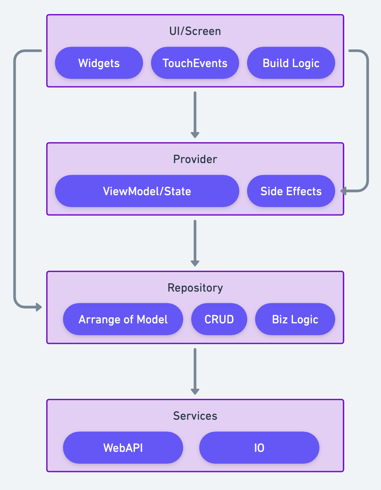

# QueryProvider - React Query for Flutter/Riverpod

A powerful data fetching and caching library for Flutter applications built on top of Riverpod, inspired by TanStack Query (React Query). QueryProvider solves common data management challenges in Flutter apps by providing intelligent caching, background updates, optimistic updates, and seamless state synchronization.

## 📋 Table of Contents

- [The Problem](#-the-problem)
- [The Solution](#-the-solution)
- [Key Features](#-key-features)
- [Installation](#-installation)
- [Quick Start](#-quick-start)
- [Core Concepts](#-core-concepts)
- [API Reference](#-api-reference)
- [Advanced Usage](#-advanced-usage)
- [Pagination](#-pagination)
- [Comparison](#-comparison)
- [Migration Guide](#-migration-guide)

## 🚨 The Problem

When building Flutter applications with traditional Riverpod providers, developers face several recurring challenges:

### 1. **Manual Cache Management**

```dart
// ❌ Traditional approach - no caching, refetches every time
final usersProvider = FutureProvider<List<User>>((ref) async {
  return ApiService.fetchUsers(); // Always hits the network
});
```

### 2. **No Background Updates**

```dart
// ❌ Data becomes stale, no automatic refresh
final userProvider = FutureProvider.family<User, int>((ref, id) async {
  return ApiService.fetchUser(id); // Stale data, no refresh mechanism
});
```

### 3. **No Retry Logic**

```dart
// ❌ No automatic retry on failure
final dataProvider = FutureProvider<Data>((ref) async {
  try {
    return await ApiService.fetchData();
  } catch (e) {
    // Fails permanently, no retry
    rethrow;
  }
});
```

### 4. **No Optimistic Updates**

```dart
// ❌ No way to update UI optimistically
final updateUserProvider = FutureProvider.family<User, UpdateUserRequest>((ref, request) async {
  return ApiService.updateUser(request); // UI waits for server response
});
```

### 5. **Complex Pagination**

You need to write a lot of boilerplate code to handle pagination

### 6. **Complex Pagination**

No standardized way to use provider, introduce redundant code or side effects

## 🚀 The Solution

QueryProvider addresses all these problems with a React Query-inspired approach:

### ✅ **Intelligent Caching**

QueryProvider automatically caches data and handles pagination. It can cache data in memory or local storage, and can manage the cache size and expiration time.

```dart
final usersProvider = asyncQueryProvider<List<User>>(
  name: 'users',
  queryFn: (ref) => ApiService.fetchUsers(),
  options: QueryOptions(
    staleTime: Duration(minutes: 5), // Fresh for 5 minutes
    cacheTime: Duration(minutes: 30), // Cached for 30 minutes
    cacheStrategy: QueryCacheStrategy.disk, // Store in disk
    jsonParser: (json) => User.fromJson(json), // Parse json
  ),
);
```

### ✅ **Automatic Background Updates or Refetch**

```dart
final userProvider = asyncQueryProviderFamily<User, int>(
  name: 'user',
  queryFn: (ref, userId) => ApiService.fetchUser(userId),
  options: QueryOptions(
    refetchOnWindowFocus: true, // Refetch when window gains focus or Refetch when app comes to foreground
    refetchInterval: Duration(minutes: 10), // Periodic updates
  ),
);
```

### ✅ **Enhanced Loading States with `keepPreviousData`**

```dart
// Keep showing old data while fetching new data
final usersProvider = asyncQueryProvider<List<User>>(
  name: 'users',
  queryFn: (ref) => ApiService.fetchUsers(),
  options: QueryOptions(
    keepPreviousData: true, // Show stale data while refetching
    staleTime: Duration(minutes: 5),
  ),
);

Widget build(BuildContext context, WidgetRef ref) {
  final usersAsync = ref.watch(usersProvider);
  
  return usersAsync.when(
    loading: () => CircularProgressIndicator(),
    error: (error, stack) => ErrorWidget(error),
    data: (users) => UsersList(users), // No loading flicker on refetch!
  );
}
```

### ✅ **Optimistic Updates with Rollback**

```dart
final updateUserMutation = mutationProvider<User, UpdateUserRequest>(
  name: 'update-user',
  mutationFn: (ref, request) => ApiService.updateUser(request),
  onMutate: (ref, request) async {
    final queryClient = ref.read(memoryQueryClientProvider);
    
    // Optimistic update
    final currentUser = queryClient.getQueryData<User>('user-${request.id}');
    queryClient.setQueryData('user-${request.id}', request.toUser());
    
    return currentUser; // Return for rollback
  },
  onError: (ref, request, error, stackTrace) async {
    final queryClient = ref.read(memoryQueryClientProvider);
    // Rollback on error
    queryClient.invalidateQueries('user-${request.id}');
  },
);
```

### ✅ **Smart Retry Logic**

```dart
final dataProvider = asyncQueryProvider<Data>(
  name: 'data',
  queryFn: (ref) => ApiService.fetchData(),
  options: QueryOptions(
    retry: 3, // Retry 3 times
    retryDelay: Duration(seconds: 2), // Wait 2 seconds between retries
  ),
);
```

### ✅ **Unify the Development of Providers**

- Categorize all functions of Providers into CRUD operations, make it easier to maintain.
- Standardize the naming convention of Providers, make it easier to understand.
- Standardize the way to operate database or file via the Provider and in a MVVM style.



## 🎯 Key Features

| Feature | Traditional Riverpod | QueryProvider |
|---------|---------------------|---------------|
| **Caching** | Manual | ✅ Automatic with `staleTime`/`cacheTime` and `cacheStrategy`|
| **Background Updates** | None | ✅ Window focus, app focus, intervals |
| **Loading States** | ✅ Built-in `AsyncValue` | ✅ `AsyncValue` + `keepPreviousData` |
| **Optimistic Updates** | Complex | ✅ CRUD with simple `onMutate`/`onError` callbacks |
| **Offline Support** | None | ✅ Cache-first with stale data |

## 📦 Installation

Add to your `pubspec.yaml`:

```yaml
dependencies:
  query_provider: ^1.0.0
  flutter_riverpod: ^2.6.1
```

## 🚀 Quick Start

### 1. Setup QueryClient

```dart
// main.dart
import 'package:flutter/material.dart';
import 'package:flutter_riverpod/flutter_riverpod.dart';
import 'package:query_provider/query_provider.dart';

void main() {
  runApp(
    ProviderScope(
      child: MyApp(),
    ),
  );
}
```

### 2. Create Query Providers

```dart
// providers/user_providers.dart
import 'package:query_provider/query_provider.dart';
import '../models/user.dart';
import '../services/api_service.dart';

// Simple query
final usersProvider = asyncQueryProvider<List<User>>(
  name: 'users',
  queryFn: (ref) => ApiService.fetchUsers(),
  options: QueryOptions(
    staleTime: Duration(minutes: 5),
    cacheTime: Duration(minutes: 30),
    cacheStrategy: QueryCacheStrategy.disk, // Store in disk
    jsonParser: (json) => User.fromJson(json), // Parse json
  ),
);

// Parameterized query
final userProvider = asyncQueryProviderFamily<User, int>(
  name: 'user',
  queryFn: (ref, userId) => ApiService.fetchUser(userId),
  options: QueryOptions(
    staleTime: Duration(minutes: 3),
    refetchOnWindowFocus: true,
  ),
);

// Mutation
final createUserMutation = mutationProvider<User, CreateUserRequest>(
  name: 'create-user',
  mutationFn: (ref, request) => ApiService.createUser(request),
  onSuccess: (ref, user, request) async {
    final queryClient = ref.read(memoryQueryClientProvider);
    queryClient.invalidateQueries('users'); // Refresh users list
  },
);
```

### 3. Use in Widgets

```dart
// screens/users_screen.dart
class UsersScreen extends ConsumerWidget {
  @override
  Widget build(BuildContext context, WidgetRef ref) {
    final usersAsync = ref.watch(usersProvider);
    final createUser = ref.watch(createUserMutation);

    return Scaffold(
      appBar: AppBar(title: Text('Users')),
      body: usersAsync.when(
        loading: () => Center(child: CircularProgressIndicator()),
        error: (error, stack) => Center(
          child: Column(
            mainAxisAlignment: MainAxisAlignment.center,
            children: [
              Text('Error: $error'),
              ElevatedButton(
                onPressed: () => ref.refresh(usersProvider),
                child: Text('Retry'),
              ),
            ],
          ),
        ),
        data: (users) => ListView.builder(
        itemCount: users.length,
        itemBuilder: (context, index) {
          final user = users[index];
          return ListTile(
            title: Text(user.name),
            subtitle: Text(user.email),
              onTap: () => Navigator.push(
                context,
                MaterialPageRoute(
                  builder: (_) => UserDetailScreen(userId: user.id),
                ),
              ),
          );
        },
      ),
      ),
      floatingActionButton: FloatingActionButton(
        onPressed: createUser.isLoading ? null : () async {
          try {
            await ref.read(createUserMutation.notifier).mutate(
              CreateUserRequest(name: 'New User', email: 'user@example.com'),
            );
            ScaffoldMessenger.of(context).showSnackBar(
              SnackBar(content: Text('User created!')),
            );
          } catch (error) {
            ScaffoldMessenger.of(context).showSnackBar(
              SnackBar(content: Text('Error: $error')),
            );
          }
        },
        child: createUser.isLoading 
          ? SizedBox(
              width: 20,
              height: 20,
              child: CircularProgressIndicator(strokeWidth: 2),
            )
          : Icon(Icons.add),
      ),
    );
  }
}
```

## 🧠 Core Concepts

### Query Providers

Query providers handle data fetching with intelligent caching:

```dart
// Basic query
final todosProvider = asyncQueryProvider<List<Todo>>(
  name: 'todos',
  queryFn: (ref) => ApiService.fetchTodos(),
  options: QueryOptions(
    staleTime: Duration(minutes: 5), // Data fresh for 5 minutes
    cacheTime: Duration(minutes: 30), // Keep in cache for 30 minutes
    cacheStrategy: QueryCacheStrategy.disk, // Store in disk
    jsonParser: (json) => Todos.fromJson(json), // Parse json
    retry: 3, // Retry failed requests 3 times
    refetchOnWindowFocus: true, // Refetch when window gains focus
  ),
);

// Parameterized query
final todoProvider = asyncQueryProviderFamily<Todo, int>(
  name: 'todo',
  queryFn: (ref, todoId) => ApiService.fetchTodo(todoId),
);
```

### Mutations

Mutations handle data modifications with optimistic updates:

```dart
final updateTodoMutation = mutationProvider<Todo, UpdateTodoRequest>(
  name: 'update-todo',
  mutationFn: (ref, request) => ApiService.updateTodo(request),
  onMutate: (ref, request) async {
    // Optimistic update
    final queryClient = ref.read(memoryQueryClientProvider);
    final previousTodo = queryClient.getQueryData<Todo>('todo-${request.id}');
    
    queryClient.setQueryData('todo-${request.id}', request.toTodo());
    
    return previousTodo; // For rollback
  },
  onError: (ref, request, error, stackTrace) async {
    // Rollback on error
    final queryClient = ref.read(memoryQueryClientProvider);
    queryClient.invalidateQueries('todo-${request.id}');
  },
  onSuccess: (ref, todo, request) async {
    // Update related queries
    final queryClient = ref.read(memoryQueryClientProvider);
    queryClient.invalidateQueries('todos');
  },
);
```

### Query Options

Configure query behavior with `QueryOptions`:

```dart
QueryOptions<T>(
  staleTime: Duration(minutes: 5), // How long data stays fresh
  cacheTime: Duration(minutes: 30), // How long unused data stays cached
  refetchOnMount: true, // Refetch when query mounts
  refetchOnWindowFocus: false, // Refetch on window focus or Refetch when app comes to foreground
  pauseRefetchInBackground: true, // Pause refetching in background
  refetchInterval: Duration(minutes: 1), // Periodic refetching
  retry: 3, // Number of retry attempts
  retryDelay: Duration(seconds: 1), // Delay between retries
  enabled: true, // Whether query is enabled
  keepPreviousData: false, // Keep previous data while fetching new
  onSuccess: (data) => print('Success: $data'),
  onError: (error, stackTrace) => print('Error: $error'),
)
```

## 📚 API Reference

### Query Providers

#### `asyncQueryProvider<T>`

Creates a basic async query provider.

```dart
AsyncNotifierProvider<AsyncQueryNotifier<T>, T> asyncQueryProvider<T>({
  required String name, // Unique identifier for caching
  required QueryFunctionWithRef<T> queryFn, // Function that fetches data
  QueryOptions<T>? options, // Configuration options
})
```

#### `asyncQueryProviderFamily<T, P>`

Creates a parameterized async query provider.

```dart
AsyncNotifierProviderFamily<AsyncQueryNotifierFamily<T, P>, T, P> asyncQueryProviderFamily<T, P>({
  required String name,
  required QueryFunctionWithParamsWithRef<T, P> queryFn,
  QueryOptions<T>? options,
})
```

#### `queryProvider<T>` (StateNotifier-based)

Creates a StateNotifier-based query provider for more control.

```dart
StateNotifierProvider<QueryNotifier<T>, QueryState<T>> queryProvider<T>({
  required String name,
  required QueryFunctionWithRef<T> queryFn,
  QueryOptions<T> options = const QueryOptions(),
})
```

### Mutations

#### `mutationProvider<TData, TVariables>`

Creates a mutation provider.

```dart
StateNotifierProvider<MutationNotifier<TData, TVariables>, MutationState<TData>> createProvider<TData, TVariables>({
  required String name,
  required CreateMutationFunctionWithRef<TData, TVariables> mutationFn,
  int? retry = 0,
  Duration? retryDelay = const Duration(seconds: 1),
  OnSuccessFunctionWithRef<TData, TVariables>? onSuccess,
  OnErrorFunctionWithRef<TData, TVariables>? onError,
  OnMutateFunctionWithRef<TData, TVariables>? onMutate,
})
```

### Query Client

Access the query client for manual cache operations:

```dart
    final queryClient = ref.read(memoryQueryClientProvider);

// Get cached data
final users = queryClient.getQueryData<List<User>>('users');

// Set cached data
queryClient.setQueryData('users', newUsers);

// Invalidate queries (triggers refetch)
queryClient.invalidateQueries('users');

// Remove queries from cache
queryClient.removeQueries('users');

// Get query state
final queryState = queryClient.getQueryState('users');
```

## 🔧 Advanced Usage

### Dependent Queries

```dart
final userProvider = asyncQueryProviderFamily<User, int>(
  name: 'user',
  queryFn: (ref, userId) => ApiService.fetchUser(userId),
);

final userPostsProvider = asyncQueryProviderFamily<List<Post>, int>(
  name: 'user-posts',
  queryFn: (ref, userId) async {
    // Wait for user data first
    final user = await ref.watch(userProvider(userId).future);
    return ApiService.fetchUserPosts(user.id);
  },
  options: QueryOptions(
    enabled: true, // Can be dynamic based on user data
  ),
);
```

### Infinite Queries

```dart
final infinitePostsProvider = infiniteQueryProvider<List<Post>, int>(
  name: 'infinite-posts',
  queryFn: (ref, pageParam) => ApiService.fetchPosts(page: pageParam),
  getNextPageParam: (lastPage, allPages) {
    return lastPage.hasMore ? allPages.length + 1 : null;
  },
  options: InfiniteQueryOptions(
    staleTime: Duration(minutes: 5),
  ),
);
```

### Optimistic Updates with Rollback

```dart
final updatePostMutation = mutationProvider<Post, UpdatePostRequest>(
  name: 'update-post',
  mutationFn: (ref, request) => ApiService.updatePost(request),
  onMutate: (ref, request) async {
    final queryClient = ref.read(memoryQueryClientProvider);
    
    // Cancel outgoing refetches
    await queryClient.cancelQueries('posts');
    
    // Snapshot previous value
    final previousPosts = queryClient.getQueryData<List<Post>>('posts');
    
    // Optimistically update
    if (previousPosts != null) {
      final updatedPosts = previousPosts.map((post) {
        return post.id == request.id ? request.toPost() : post;
      }).toList();
      queryClient.setQueryData('posts', updatedPosts);
    }
    
    return {'previousPosts': previousPosts};
  },
  onError: (ref, request, error, stackTrace) async {
    final queryClient = ref.read(memoryQueryClientProvider);
    final context = error.context as Map<String, dynamic>?;
    
    // Rollback to previous value
    if (context?['previousPosts'] != null) {
      queryClient.setQueryData('posts', context!['previousPosts']);
    }
  },
  onSuccess: (ref, post, request) async {
    final queryClient = ref.read(memoryQueryClientProvider);
    queryClient.invalidateQueries('posts');
  },
);
```

### Custom Query Keys

```dart
// Simple key
final userProvider = asyncQueryProvider<User>(
  name: 'user',
  queryFn: (ref) => ApiService.fetchCurrentUser(),
);

// Complex key with parameters
final searchProvider = asyncQueryProviderFamily<List<Post>, SearchParams>(
  name: 'search',
  queryFn: (ref, params) => ApiService.search(params),
);

// Usage
final searchResults = ref.watch(searchProvider(SearchParams(
  query: 'flutter',
  category: 'tech',
  sortBy: 'date',
)));
```

### Error Boundaries

```dart
class QueryErrorBoundary extends ConsumerWidget {
  final Widget child;
  
  const QueryErrorBoundary({required this.child});

  @override
  Widget build(BuildContext context, WidgetRef ref) {
    return child;
  }
}

// Usage in widget
Widget build(BuildContext context, WidgetRef ref) {
  final postsAsync = ref.watch(postsProvider);
  
  return postsAsync.when(
    loading: () => LoadingWidget(),
    error: (error, stack) => ErrorBoundary(
      error: error,
      onRetry: () => ref.refresh(postsProvider),
    ),
    data: (posts) => PostsList(posts),
  );
}
```

## 📄 Pagination

QueryProvider provides comprehensive pagination support through multiple approaches, from simple offset-based pagination to advanced infinite scroll implementations.

### Simple Offset Pagination

For traditional page-based pagination with page numbers:

```dart
// Pagination state provider
final paginationStateProvider = StateProvider<PaginationState>((ref) => 
  PaginationState(page: 1, limit: 20));

class PaginationState {
  final int page;
  final int limit;
  final int? total;
  
  const PaginationState({required this.page, required this.limit, this.total});
  
  int get offset => (page - 1) * limit;
  bool get hasNextPage => total == null || (page * limit) < total!;
  bool get hasPreviousPage => page > 1;
  int get totalPages => total == null ? 1 : (total! / limit).ceil();
  
  PaginationState copyWith({int? page, int? limit, int? total}) => PaginationState(
    page: page ?? this.page,
    limit: limit ?? this.limit,
    total: total ?? this.total,
  );
}

// Paginated posts provider
final paginatedPostsProvider = asyncQueryProviderFamily<PaginatedResponse<Post>, PaginationParams>(
  name: 'paginated-posts',
  queryFn: (ref, params) => ApiService.fetchPostsPaginated(
    page: params.page,
    limit: params.limit,
    search: params.search,
  ),
  options: QueryOptions(
    staleTime: Duration(minutes: 2),
    cacheTime: Duration(minutes: 10),
    keepPreviousData: true, // Keep previous page while loading new one
  ),
);

class PaginationParams {
  final int page;
  final int limit;
  final String? search;
  
  const PaginationParams({required this.page, required this.limit, this.search});
  
  @override
  bool operator ==(Object other) =>
    identical(this, other) ||
    other is PaginationParams &&
    page == other.page &&
    limit == other.limit &&
    search == other.search;
    
  @override
  int get hashCode => Object.hash(page, limit, search);
}

class PaginatedResponse<T> {
  final List<T> data;
  final int total;
  final int page;
  final int limit;
  
  const PaginatedResponse({
    required this.data,
    required this.total,
    required this.page,
    required this.limit,
  });
  
  bool get hasNextPage => (page * limit) < total;
  bool get hasPreviousPage => page > 1;
  int get totalPages => (total / limit).ceil();
}
```

### Pagination Widget Implementation

```dart
class PaginatedPostsScreen extends ConsumerWidget {
  const PaginatedPostsScreen({super.key});

  @override
  Widget build(BuildContext context, WidgetRef ref) {
    final paginationState = ref.watch(paginationStateProvider);
    final postsAsync = ref.watch(paginatedPostsProvider(PaginationParams(
      page: paginationState.page,
      limit: paginationState.limit,
    )));

    return Scaffold(
      appBar: AppBar(
        title: const Text('Paginated Posts'),
        actions: [
          IconButton(
            onPressed: () => ref.refresh(paginatedPostsProvider(PaginationParams(
              page: paginationState.page,
              limit: paginationState.limit,
            ))),
            icon: const Icon(Icons.refresh),
          ),
        ],
      ),
      body: Column(
        children: [
          // Posts list
          Expanded(
            child: postsAsync.when(
              loading: () => const Center(child: CircularProgressIndicator()),
              error: (error, stack) => Center(
                child: Column(
                  mainAxisAlignment: MainAxisAlignment.center,
                  children: [
                    Text('Error: $error'),
                    ElevatedButton(
                      onPressed: () => ref.refresh(paginatedPostsProvider(PaginationParams(
                        page: paginationState.page,
                        limit: paginationState.limit,
                      ))),
                      child: const Text('Retry'),
                    ),
                  ],
                ),
              ),
              data: (response) => ListView.builder(
                itemCount: response.data.length,
          itemBuilder: (context, index) {
                  final post = response.data[index];
                  return ListTile(
                    title: Text(post.title),
                    subtitle: Text(post.body),
                    trailing: Text('Page ${response.page}'),
                  );
                },
              ),
            ),
          ),
          
          // Pagination controls
          Container(
            padding: const EdgeInsets.all(16),
            child: postsAsync.when(
              data: (response) => PaginationControls(
                currentPage: response.page,
                totalPages: response.totalPages,
                hasNextPage: response.hasNextPage,
                hasPreviousPage: response.hasPreviousPage,
                onPageChanged: (page) {
                  ref.read(paginationStateProvider.notifier).state = 
                    paginationState.copyWith(page: page, total: response.total);
                },
              ),
              loading: () => const SizedBox(height: 48),
              error: (_, __) => const SizedBox(height: 48),
            ),
          ),
        ],
      ),
    );
  }
}

class PaginationControls extends StatelessWidget {
  final int currentPage;
  final int totalPages;
  final bool hasNextPage;
  final bool hasPreviousPage;
  final Function(int) onPageChanged;

  const PaginationControls({
    super.key,
    required this.currentPage,
    required this.totalPages,
    required this.hasNextPage,
    required this.hasPreviousPage,
    required this.onPageChanged,
  });

  @override
  Widget build(BuildContext context) {
    return Row(
      mainAxisAlignment: MainAxisAlignment.center,
      children: [
        // First page
        IconButton(
          onPressed: currentPage > 1 ? () => onPageChanged(1) : null,
          icon: const Icon(Icons.first_page),
        ),
        
        // Previous page
        IconButton(
          onPressed: hasPreviousPage ? () => onPageChanged(currentPage - 1) : null,
          icon: const Icon(Icons.chevron_left),
        ),
        
        // Page numbers
        ...List.generate(
          5 < totalPages ? 5 : totalPages,
          (index) {
            int pageNumber;
            if (totalPages <= 5) {
              pageNumber = index + 1;
            } else if (currentPage <= 3) {
              pageNumber = index + 1;
            } else if (currentPage >= totalPages - 2) {
              pageNumber = totalPages - 4 + index;
            } else {
              pageNumber = currentPage - 2 + index;
            }
            
            return Padding(
              padding: const EdgeInsets.symmetric(horizontal: 4),
              child: pageNumber == currentPage
                  ? Container(
                      padding: const EdgeInsets.all(8),
                      decoration: BoxDecoration(
                        color: Theme.of(context).primaryColor,
                        borderRadius: BorderRadius.circular(4),
                      ),
                      child: Text(
                        '$pageNumber',
                        style: const TextStyle(color: Colors.white, fontWeight: FontWeight.bold),
                      ),
                    )
                  : TextButton(
                      onPressed: () => onPageChanged(pageNumber),
                      child: Text('$pageNumber'),
                    ),
            );
          },
        ),
        
        // Next page
        IconButton(
          onPressed: hasNextPage ? () => onPageChanged(currentPage + 1) : null,
          icon: const Icon(Icons.chevron_right),
        ),
        
        // Last page
        IconButton(
          onPressed: currentPage < totalPages ? () => onPageChanged(totalPages) : null,
          icon: const Icon(Icons.last_page),
        ),
      ],
    );
  }
}
```

### Infinite Scroll Pagination

For infinite scroll with automatic loading:

```dart
// Infinite scroll provider using existing query system
final infinitePostsProvider = asyncQueryProviderFamily<List<Post>, int>(
  name: 'infinite-posts',
  queryFn: (ref, page) => ApiService.fetchPosts(page: page),
  options: QueryOptions(
    staleTime: Duration(minutes: 5),
    cacheTime: Duration(minutes: 15),
  ),
);

// Infinite scroll state management
final infiniteScrollStateProvider = StateNotifierProvider<InfiniteScrollNotifier, InfiniteScrollState>(
  (ref) => InfiniteScrollNotifier(),
);

class InfiniteScrollState {
  final List<Post> allPosts;
  final int currentPage;
  final bool isLoadingMore;
  final bool hasReachedEnd;
  final String? error;

  const InfiniteScrollState({
    this.allPosts = const [],
    this.currentPage = 1,
    this.isLoadingMore = false,
    this.hasReachedEnd = false,
    this.error,
  });

  InfiniteScrollState copyWith({
    List<Post>? allPosts,
    int? currentPage,
    bool? isLoadingMore,
    bool? hasReachedEnd,
    String? error,
  }) => InfiniteScrollState(
    allPosts: allPosts ?? this.allPosts,
    currentPage: currentPage ?? this.currentPage,
    isLoadingMore: isLoadingMore ?? this.isLoadingMore,
    hasReachedEnd: hasReachedEnd ?? this.hasReachedEnd,
    error: error ?? this.error,
  );
}

class InfiniteScrollNotifier extends StateNotifier<InfiniteScrollState> {
  InfiniteScrollNotifier() : super(const InfiniteScrollState());

  Future<void> loadInitialPosts(WidgetRef ref) async {
    if (state.allPosts.isNotEmpty) return;
    
    try {
      final posts = await ref.read(infinitePostsProvider(1).future);
      state = state.copyWith(
        allPosts: posts,
        currentPage: 1,
        hasReachedEnd: posts.length < 20, // Assuming 20 posts per page
      );
    } catch (error) {
      state = state.copyWith(error: error.toString());
    }
  }

  Future<void> loadMorePosts(WidgetRef ref) async {
    if (state.isLoadingMore || state.hasReachedEnd) return;

    state = state.copyWith(isLoadingMore: true, error: null);

    try {
      final nextPage = state.currentPage + 1;
      final newPosts = await ref.read(infinitePostsProvider(nextPage).future);
      
      state = state.copyWith(
        allPosts: [...state.allPosts, ...newPosts],
        currentPage: nextPage,
        isLoadingMore: false,
        hasReachedEnd: newPosts.length < 20,
      );
    } catch (error) {
      state = state.copyWith(
        isLoadingMore: false,
        error: error.toString(),
      );
    }
  }

  void reset() {
    state = const InfiniteScrollState();
  }
}
```

### Infinite Scroll Widget

```dart
class InfiniteScrollPostsScreen extends ConsumerStatefulWidget {
  const InfiniteScrollPostsScreen({super.key});

  @override
  ConsumerState<InfiniteScrollPostsScreen> createState() => _InfiniteScrollPostsScreenState();
}

class _InfiniteScrollPostsScreenState extends ConsumerState<InfiniteScrollPostsScreen> {
  late ScrollController _scrollController;

  @override
  void initState() {
    super.initState();
    _scrollController = ScrollController();
    _scrollController.addListener(_onScroll);
    
    // Load initial posts
    WidgetsBinding.instance.addPostFrameCallback((_) {
      ref.read(infiniteScrollStateProvider.notifier).loadInitialPosts(ref);
    });
  }

  @override
  void dispose() {
    _scrollController.dispose();
    super.dispose();
  }

  void _onScroll() {
    if (_scrollController.position.pixels >= 
        _scrollController.position.maxScrollExtent - 200) {
      // Load more when 200px from bottom
      ref.read(infiniteScrollStateProvider.notifier).loadMorePosts(ref);
    }
  }

  @override
  Widget build(BuildContext context) {
    final scrollState = ref.watch(infiniteScrollStateProvider);

    return Scaffold(
      appBar: AppBar(
        title: const Text('Infinite Scroll Posts'),
        actions: [
          IconButton(
            onPressed: () {
              ref.read(infiniteScrollStateProvider.notifier).reset();
              ref.read(infiniteScrollStateProvider.notifier).loadInitialPosts(ref);
            },
            icon: const Icon(Icons.refresh),
          ),
        ],
      ),
      body: scrollState.allPosts.isEmpty && scrollState.error == null
          ? const Center(child: CircularProgressIndicator())
          : scrollState.error != null && scrollState.allPosts.isEmpty
              ? Center(
                  child: Column(
                    mainAxisAlignment: MainAxisAlignment.center,
                    children: [
                      Text('Error: ${scrollState.error}'),
                      ElevatedButton(
                        onPressed: () => ref.read(infiniteScrollStateProvider.notifier).loadInitialPosts(ref),
                        child: const Text('Retry'),
                      ),
                    ],
                  ),
                )
              : ListView.builder(
                  controller: _scrollController,
                  itemCount: scrollState.allPosts.length + (scrollState.hasReachedEnd ? 0 : 1),
                  itemBuilder: (context, index) {
                    if (index == scrollState.allPosts.length) {
                      // Loading indicator at the end
                      return Container(
                        padding: const EdgeInsets.all(16),
                        alignment: Alignment.center,
                        child: scrollState.isLoadingMore
                            ? const CircularProgressIndicator()
                            : scrollState.error != null
                                ? Column(
                                    children: [
                                      Text('Error: ${scrollState.error}'),
                                      ElevatedButton(
                                        onPressed: () => ref.read(infiniteScrollStateProvider.notifier).loadMorePosts(ref),
                                        child: const Text('Retry'),
                                      ),
                                    ],
                                  )
                                : const Text('No more posts'),
                      );
                    }

                    final post = scrollState.allPosts[index];
                    return ListTile(
                      title: Text(post.title),
                      subtitle: Text(post.body),
                      trailing: Text('#${post.id}'),
                    );
                  },
                ),
    );
  }
}
```

### Search with Pagination

Combining search functionality with pagination:

```dart
// Search state provider
final searchStateProvider = StateProvider<String>((ref) => '');

// Debounced search provider
final debouncedSearchProvider = Provider<String>((ref) {
  final search = ref.watch(searchStateProvider);
  final debounce = ref.keepAlive();
  
  Timer(const Duration(milliseconds: 500), debounce.close);
  return search;
});

// Search with pagination provider
final searchPostsProvider = asyncQueryProviderFamily<PaginatedResponse<Post>, SearchPaginationParams>(
  name: 'search-posts',
  queryFn: (ref, params) => ApiService.searchPosts(
    query: params.query,
    page: params.page,
    limit: params.limit,
  ),
  options: QueryOptions(
    staleTime: Duration(minutes: 1),
  cacheTime: Duration(minutes: 5),
    keepPreviousData: true,
  ),
);

class SearchPaginationParams {
  final String query;
  final int page;
  final int limit;
  
  const SearchPaginationParams({
    required this.query,
    required this.page,
    this.limit = 20,
  });
  
  @override
  bool operator ==(Object other) =>
    identical(this, other) ||
    other is SearchPaginationParams &&
    query == other.query &&
    page == other.page &&
    limit == other.limit;
    
  @override
  int get hashCode => Object.hash(query, page, limit);
}

class SearchablePostsScreen extends ConsumerWidget {
  const SearchablePostsScreen({super.key});

  @override
  Widget build(BuildContext context, WidgetRef ref) {
    final searchQuery = ref.watch(debouncedSearchProvider);
    final paginationState = ref.watch(paginationStateProvider);
    
    final searchResults = ref.watch(searchPostsProvider(SearchPaginationParams(
      query: searchQuery,
      page: paginationState.page,
      limit: paginationState.limit,
    )));

    return Scaffold(
      appBar: AppBar(
        title: const Text('Search Posts'),
        bottom: PreferredSize(
          preferredSize: const Size.fromHeight(60),
          child: Padding(
            padding: const EdgeInsets.all(16),
            child: TextField(
              decoration: const InputDecoration(
                hintText: 'Search posts...',
                prefixIcon: Icon(Icons.search),
                border: OutlineInputBorder(),
                filled: true,
                fillColor: Colors.white,
              ),
              onChanged: (value) {
                ref.read(searchStateProvider.notifier).state = value;
                // Reset to first page when searching
                ref.read(paginationStateProvider.notifier).state = 
                  paginationState.copyWith(page: 1);
              },
            ),
          ),
        ),
      ),
      body: searchQuery.isEmpty
          ? const Center(child: Text('Enter a search query'))
          : Column(
              children: [
                Expanded(
                  child: searchResults.when(
                    loading: () => const Center(child: CircularProgressIndicator()),
                    error: (error, stack) => Center(child: Text('Error: $error')),
                    data: (response) => response.data.isEmpty
                        ? const Center(child: Text('No results found'))
                        : ListView.builder(
                            itemCount: response.data.length,
                            itemBuilder: (context, index) {
                              final post = response.data[index];
                              return ListTile(
                                title: Text(post.title),
                                subtitle: Text(post.body),
                                trailing: Text('Page ${response.page}'),
                              );
                            },
                          ),
                  ),
                ),
                
                // Pagination for search results
                searchResults.when(
                  data: (response) => PaginationControls(
                    currentPage: response.page,
                    totalPages: response.totalPages,
                    hasNextPage: response.hasNextPage,
                    hasPreviousPage: response.hasPreviousPage,
                    onPageChanged: (page) {
                      ref.read(paginationStateProvider.notifier).state = 
                        paginationState.copyWith(page: page, total: response.total);
                    },
                  ),
                  loading: () => const SizedBox(height: 48),
                  error: (_, __) => const SizedBox(height: 48),
                ),
              ],
            ),
    );
  }
}
```

### Pagination Best Practices

| Practice | Description | Benefit |
|----------|-------------|---------|
| **Use `keepPreviousData`** | Keep previous page data while loading new page | Smooth UX without loading states |
| **Implement proper cache keys** | Include page/search params in provider parameters | Correct caching per page |
| **Debounce search queries** | Wait for user to stop typing before searching | Reduce API calls |
| **Preload next page** | Load next page in background when near end | Instant navigation |
| **Handle empty states** | Show appropriate UI for no results | Better user experience |
| **Error boundaries** | Graceful error handling per page | Resilient pagination |
| **Loading indicators** | Show loading states for better UX | User feedback |
| **Scroll position preservation** | Remember scroll position when navigating | Seamless navigation |

### Performance Optimization

```dart
// Preload next page for better UX
final preloadNextPageProvider = Provider.family<void, PaginationParams>((ref, params) {
  // Preload next page when current page is loaded
  Timer(const Duration(milliseconds: 100), () {
    if (params.page > 0) {
      ref.read(paginatedPostsProvider(PaginationParams(
        page: params.page + 1,
        limit: params.limit,
      )));
    }
  });
});

// Virtual scrolling for large lists
class VirtualScrollView extends StatelessWidget {
  final List<Post> items;
  final double itemHeight;
  final Widget Function(BuildContext, Post) itemBuilder;

  const VirtualScrollView({
    super.key,
    required this.items,
    required this.itemHeight,
    required this.itemBuilder,
  });

  @override
  Widget build(BuildContext context) {
    return ListView.builder(
      itemCount: items.length,
      itemExtent: itemHeight, // Fixed height for better performance
      itemBuilder: (context, index) => itemBuilder(context, items[index]),
    );
  }
}
```

QueryProvider's pagination system provides flexible, performant solutions for all common pagination patterns while maintaining the benefits of intelligent caching and background updates.

## ⚖️ Comparison

### QueryProvider vs Traditional Riverpod

| Aspect | Traditional Riverpod | QueryProvider |
|--------|---------------------|---------------|
| **Setup Complexity** | Simple | Moderate |
| **Caching** | Manual | Automatic |
| **Background Updates** | Manual | Automatic |
| **Error Handling** | Basic | Built-in with retry |
| **Loading States** | Built-in (`AsyncValue`) | Built-in + `keepPreviousData` |
| **Optimistic Updates** | Complex | Simple |
| **DevTools Support** | Basic | Rich |
| **Learning Curve** | Low | Moderate |
| **Bundle Size** | Small | Moderate |

### When to Use QueryProvider

✅ **Use QueryProvider when:**

- Building data-heavy applications
- Need intelligent caching and background updates
- Want optimistic updates with rollback
- Require offline-first behavior
- Building real-time or collaborative apps
- Need comprehensive error handling and retry logic

❌ **Use Traditional Riverpod when:**

- Building simple apps with minimal data fetching
- Bundle size is critical
- Team is not familiar with React Query concepts
- Need maximum control over every aspect of state management

## 📈 Migration Guide

### From FutureProvider

```dart
// Before
final usersProvider = FutureProvider<List<User>>((ref) async {
  return ApiService.fetchUsers();
});

// After
final usersProvider = asyncQueryProvider<List<User>>(
  name: 'users',
  queryFn: (ref) => ApiService.fetchUsers(),
  options: QueryOptions(
    staleTime: Duration(minutes: 5),
    cacheTime: Duration(minutes: 30),
  ),
);
```

### From StateNotifierProvider

```dart
// Before
class UsersNotifier extends StateNotifier<AsyncValue<List<User>>> {
  UsersNotifier() : super(const AsyncValue.loading()) {
    fetchUsers();
  }

  Future<void> fetchUsers() async {
    state = const AsyncValue.loading();
    try {
      final users = await ApiService.fetchUsers();
      state = AsyncValue.data(users);
    } catch (error, stackTrace) {
      state = AsyncValue.error(error, stackTrace);
    }
  }
}

final usersProvider = StateNotifierProvider<UsersNotifier, AsyncValue<List<User>>>(
  (ref) => UsersNotifier(),
);

// After
final usersProvider = asyncQueryProvider<List<User>>(
  name: 'users',
  queryFn: (ref) => ApiService.fetchUsers(),
  options: QueryOptions(
    staleTime: Duration(minutes: 5),
    retry: 3,
    refetchOnWindowFocus: true,
  ),
);
```

### From Manual Cache Management

```dart
// Before - Manual caching
class CacheNotifier extends StateNotifier<Map<String, dynamic>> {
  CacheNotifier() : super({});
  
  Future<User> getUser(int id) async {
    final cacheKey = 'user-$id';
    if (state.containsKey(cacheKey)) {
      final entry = state[cacheKey];
      if (DateTime.now().difference(entry['timestamp']).inMinutes < 5) {
        return entry['data'];
      }
    }
    
    final user = await ApiService.fetchUser(id);
    state = {
      ...state,
      cacheKey: {
        'data': user,
        'timestamp': DateTime.now(),
      },
    };
    return user;
  }
}

// After - Automatic caching
final userProvider = asyncQueryProviderFamily<User, int>(
  name: 'user',
  queryFn: (ref, userId) => ApiService.fetchUser(userId),
  options: QueryOptions(
    staleTime: Duration(minutes: 5),
    cacheTime: Duration(minutes: 30),
  ),
);
```

## 🎉 Conclusion

QueryProvider brings the power of React Query to Flutter, solving common data management challenges with:

- **🚀 Zero-config caching** - Works out of the box with `staleTime` and `cacheTime`
- **🔄 Smart background updates** - Keep data fresh automatically with window focus, app focus, and interval refetching
- **⚡ Optimistic updates** - Instant UI feedback with automatic rollback on errors
- **🛡️ Built-in error handling** - Automatic retry logic with exponential backoff
- **🧠 Intelligent request deduplication** - No duplicate network calls
- **📊 Enhanced loading states** - `keepPreviousData` prevents loading flickers during refetches

Start building better Flutter apps today with QueryProvider!

## 📖 Further Reading

- [API Documentation](./docs/API.md)
- [Examples](./example/)
- [Migration Guide](./docs/MIGRATION.md)
- [Best Practices](./docs/BEST_PRACTICES.md)
- [Troubleshooting](./docs/TROUBLESHOOTING.md)

## 🤝 Contributing

We welcome contributions! Please see our [Contributing Guide](./CONTRIBUTING.md) for details.

## 📄 License

This project is licensed under the MIT License - see the [LICENSE](./LICENSE) file for details.
